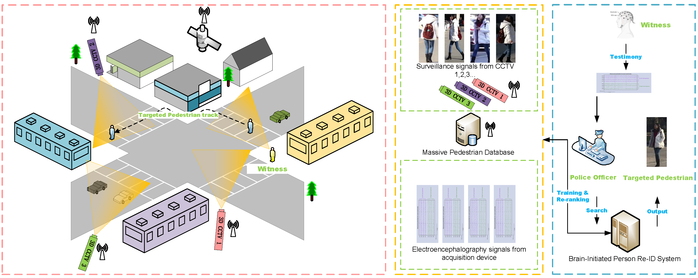
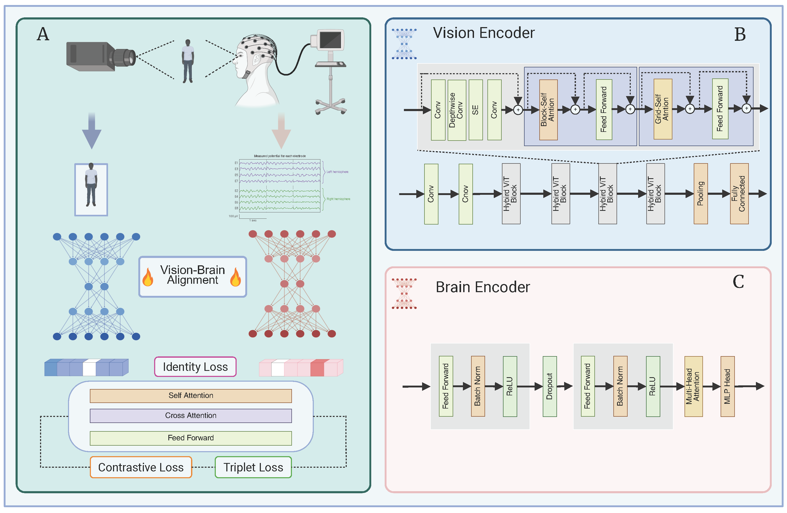
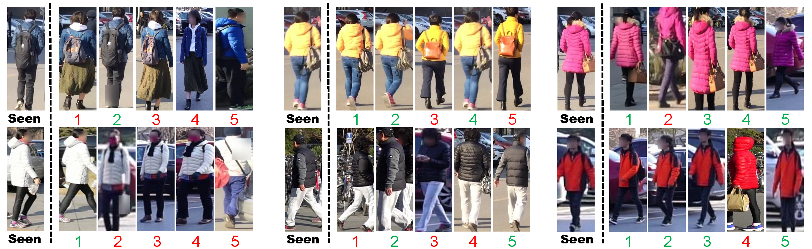

# 🧠 BIRD: Brain-Initiated Person Re-identification

<p align="center">
  <a href="https://arxiv.org/">  </a>
  <a href="https://github.com/EEG-FGBIO/BIRD/blob/main/LICENSE">  </a>
  <a href="https://github.com/EEG-FGBIO/BIRD/issues">  </a>
  <a href="https://github.com/EEG-FGBIO/BIRD/stargazers">  </a>
</p>

<p align="center">
  
</p>

---

## 📃 Overview

**BIRD** (Brain-Initiated Re-ID) is the first open-source framework and benchmark for EEG-based fine-grained cross-modal person re-identification. Unlike traditional visual or text-based Re-ID methods, BIRD enables **privacy-preserving** and **real-time** retrieval using non-invasive brain signals (EEG), aligning them with pedestrian images through contrastive learning and mutual information regularization.

<p align="center">
  
</p>

> ✨ Our [preprint paper](https://arxiv.org/abs/2408.00096) demonstrates for the first time that brain signals can decode fine-grained identity information, opening a novel direction for **neural decoding and person Re-ID**.

---

## 🌟 Coming Soon!

We are preparing to **release** the following components:

* [x] 📊 **Three large-scale datasets**: CUHK-PEDES-EEG, RSTPReid-EEG, ICFG-PEDES-EEG (tri-modal: EEG + Image + Text)
* [x] 🧐 **BIRD Codebase**: EEG preprocessing, image encoders, contrastive fusion models
* [x] 📊 **Visualization tools**: t-SNE plots, connectivity maps, topomaps
* [x] ⚖️ **Evaluation metrics**: Rank\@K, MI estimates, rhythm/region sensitivity
* [ ] 🌎 Full documentation and scripts for reproducible experiments

> Please **star** the repo ⭐ and stay tuned! Official release will be announced here soon!

---

## 📈 Key Features

* 🎧 EEG-Image-Text **tri-modal benchmark datasets**
* 🪤 Transformer-based EEG encoder with rhythm-region analysis
* 📊 HybridViT image encoder with cross-attention fusion
* 🧰 Mutual Information regularization for brain-visual alignment
* 🧠 Fine-grained intra-class person retrieval from brain signals

---

## 📖 Paper

If you use this repository or datasets, please cite:

```bibtex
@article{jiang2024bird,
  title={BIRD: Brain-Initiated Person Re-identification},
  author={Jiang, Fanzhi and Yang, Su and Liu, Liwen and Zhang, Jiaxiang and Xie, Xianghua},
  journal={arXiv preprint arXiv:2408.00096},
  year={2024}
}
```

---

## 📹 Demo: Retrieval via EEG

<p align="center">
  
</p>

---

## 🧳 EEG Signal Visualization

<p align="center">
  
</p>

---

## 🚀 Highlights from Our TPAMI Paper

* 🔎 **First EEG-based fine-grained Re-ID system**
* 🔄 **Contrastive cross-modal training** for EEG-visual alignment
* 📊 Comprehensive **neuroscience analysis**: connectivity, rhythm decoding, linguistic activation
* 🧰 Benchmark: 3 EEG datasets, 1000+ samples each, 60+ channel EEG
* 🤝 Cross-modal person retrieval via brain signals, even in zero-shot setting

---

## 📢 Stay Updated

* ✨ [Project Page](https://github.com/EEG-FGBIO/BIRD)
* 📲 [Twitter Updates](https://twitter.com/EEG_FGBIO)
* 🌐 [Lab Website](https://www.swansea.ac.uk/compsci/)

Feel free to open an issue or discussion if you have questions. We are excited to share more soon!

---

## 🌟 Acknowledgments

Thanks to all collaborators and participants who contributed to EEG data collection and system development. We also thank the reviewers for their insightful feedback.

---

<p align="center">
  🎉 BIRD will be open-sourced soon. Please stay tuned! 🚀
</p>
