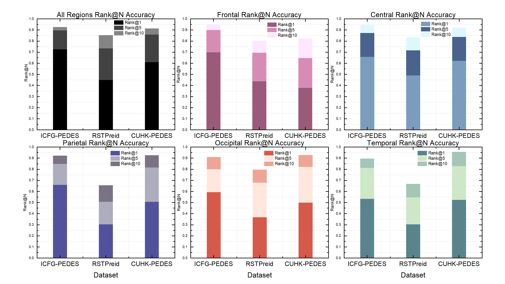
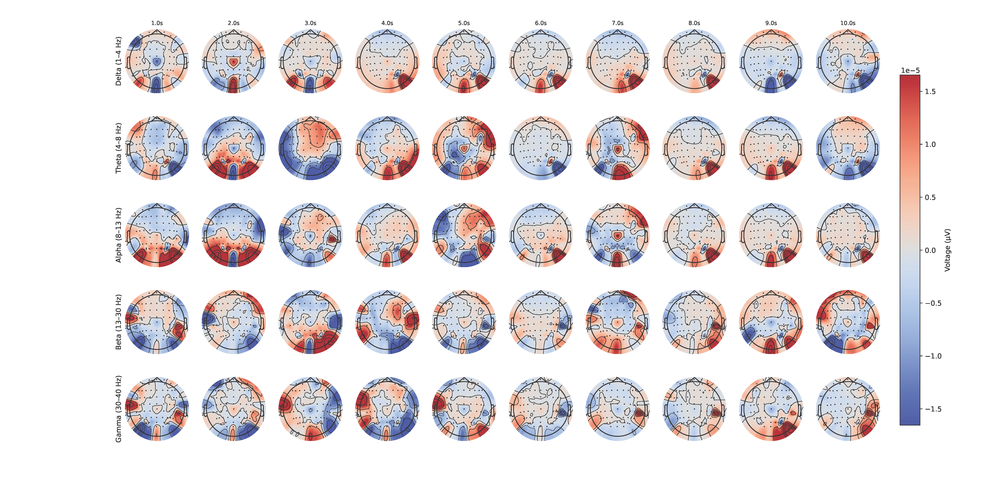

# 🧠 BIRD: Brain-Initiated Person Re-identification

<p align="center">
  <a href="https://arxiv.org/abs/2408.00096">  </a>
  <a href="https://www.apache.org/licenses/LICENSE-2.0">  </a>
  <a href="https://github.com/EEG-FGBIO/BIRD/issues">  </a>
  <a href="https://github.com/EEG-FGBIO/BIRD/stargazers">  </a>
</p>

<p align="center">
  
</p>

---

## 📃 Overview

**BIRD** (Brain-Initiated Person Re-ID) is the first open-source framework and benchmark for EEG-based fine-grained cross-modal person re-identification. Unlike traditional visual or text-based Re-ID methods, BIRD enables **privacy-preserving** and **real-time** retrieval using non-invasive brain signals (EEG), aligning them with pedestrian images through contrastive learning and mutual information regularization.

<p align="center">
  
</p>

> ✨ Our [preprint paper](https://arxiv.org/abs/2408.00096) demonstrates for the first time that brain signals can decode fine-grained identity information, opening a novel direction for **neural decoding and person Re-ID**.

---

## 🌟 Coming Soon!

We are preparing to **release** the following components:

* [x] 📊 **Three benchmarks**: CUHK-PEDES-EEG, RSTPReid-EEG, ICFG-PEDES-EEG (tri-modal: EEG + Image + Text)
* [x] 🧐 **BIRD Codebase**: EEG preprocessing, image encoders, contrastive fusion models
* [x] 📊 **Visualization Tools**: t-SNE plots, connectivity maps, topomaps
* [x] ⚖️ **Evaluation Metrics**: Rank\@K, MI estimates, rhythm/region sensitivity
* [ ] 🌎 Full documentation and scripts for reproducible experiments

> Please **star** the repo ⭐ and stay tuned! Official release will be announced here soon!

---

## 📈 Key Features

* 🎧 EEG-Image-Text **tri-modal benchmark datasets**
* 🪤 Transformer-based EEG encoder with rhythm-region analysis
* 📊 HybridViT image encoder with cross-attention fusion
* 🧰 Mutual Information regularization for brain-visual alignment
* 🧠 Fine-grained intra-class person retrieval from brain signals

---

## 📖 Paper

If you use this repository or datasets, please cite:

```bibtex
@article{jiang2024bird,
  title={BIRD: Brain-Initiated Person Re-identification},
  author={Jiang, Fanzhi and Yang, Su and Zhang, Jiaxiang and Xie, Xianghua},
  journal={arXiv preprint arXiv:2408.00096},
  year={2025}
}
```
## 📹 Quantitative analysis of different brain regions

<p align="center">
  
</p>


---

## 📹 Qualitative results on the Brain-CMPR benchmark

<p align="center">
  
</p>

---

## 🧳 Topographical maps of EEG voltage

<p align="center">
  
</p>

---

## 🚀 Highlights from Our Paper

* 🔎 **First EEG-based fine-grained Re-ID system**
* 🔄 **Contrastive cross-modal training** for EEG-visual alignment
* 📊 Comprehensive **neuroscience analysis**: connectivity, rhythm decoding, linguistic activation
* 🧰 Benchmark: 3 EEG datasets, 1000+ samples each, 60+ channel EEG
* 🤝 Cross-modal person retrieval via brain signals, even in zero-shot setting

---

## 📢 Stay Updated

* ✨ [Project Page](https://github.com/fonsjiang/BIRD/)
* 📲 [Twitter Updates](https://twitter.com/BIRD/)
* 🌐 [Lab Website](http://csvision.swan.ac.uk)

Feel free to open an issue or discussion if you have questions. We are excited to share more soon!

---

## 🌟 Acknowledgments

Thanks to all collaborators and participants who contributed to EEG data collection and system development. This work was supported by the Engineering and Physical Sciences Research Council (EPSRC) of UK Research and Innovation (UKRI) through the Doctoral Training Partnerships (DTP).

---

